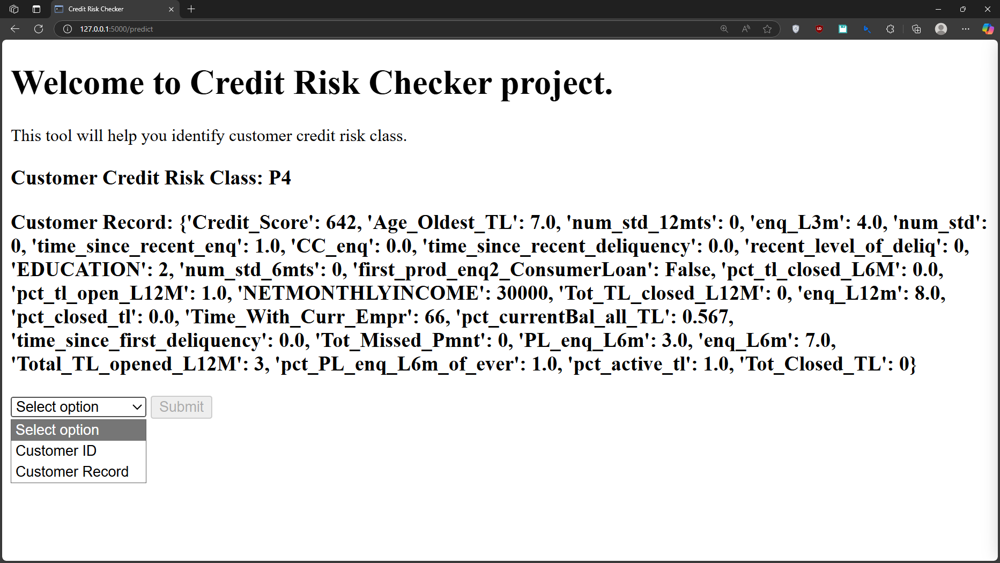

### Introduction:
This project is designed to classify customers into different credit risk categories based on their financial data, which can help financial institutions and analysts in credit risk assessment. By leveraging machine learning techniques, this project aims to provide a two-stage model for assessing credit risk without relying solely on credit scores.

### Report:
The executive summary is build with focus on providing insights and outcomes from the project to the non-technical audience.

### Project Structure:
* `dataset/`: Contains the dataset files.
* `notebook/`: Jupyter notebooks for data exploration and initial model development.
* `artifacts/`: Preprocessed data created after various feature engineering steps.
* `src/`: Python scripts for model training and local deployment.
* `models/`: Saved models and related files.
* `deliverables/`: Final model and reports.

Note: The preprocessing and deployment scripts are part of the deliverables, but to prevent repetitive storage, they are not stored in deliverables.

### Dataset:
This project utilizes customer credit records from banks or financial lending institutions and CIBIL agencies received separately. The raw data from the two entities are combined using Python pandas in the notebook. The combined data is processed in `explore.ipynb`, which generates and stores processed data from multiple steps in `artifacts`.

The processed data in `artifacts` can be used to train models and evaluate performance using the provided scripts in `src`, making it a valuable tool for credit risk analysis and decision-making.

The dataset can also be found on Kaggle: [Leading Indian Bank and CIBIL Real World Dataset](https://www.kaggle.com/datasets/saurabhbadole/leading-indian-bank-and-cibil-real-world-dataset)

### Usage:
Follow these steps to run the webapp on your local machine:
1. Clone the repository:
    ```bash
    git clone https://github.com/shashankgarewal/credit-risk-checker.git
    ```
2. Navigate to the project directory and create a virtual environment:
    ```bash
    cd credit-risk-assessment
    python -m venv venv
    source venv/bin/activate  # On Windows use `venv\Scripts\activate`
    ```
3. Install the required packages:
    ```bash
    pip install -r requirements.txt
    ```
4. Run the Flask app:
    ```bash
    python src/deploy.py
    ```
5. Open your web browser and go to the following link to access the application:
    ```
    http://127.0.0.1:5000
    ```
### Screenshot:


### Exploration:
In addition to building the credit risk assessment system, following expermental analysis and modeling were conducted:
- In [`explore1`](src/explore1_model.ipynb) notebook, it was oberserved the accuracy of credit risk classification significantly degrades when credit score metrics formulated by CIBIL agencies are not used in the modeling process.

- In [`explore2`](src/explore2_model.ipynb) notebook, an attempted to formulate the credit score using the available credit records is made. The regression model's performance was surprisingly good, achieving an R² score of over 0.9, despite the notable degradation in credit risk classification when using this score metric.

- Desipte the good performance of 0.9 R² score, the formulate credit score was used for credit risk classification in [`explore3`](src/explore3_model.ipynb) which didn't revealed good credit risk classification.

### Next Steps:
- Implement dynamic model versioning for each training session.
- Enhance the front-end design for a better user experience.
- Add interactive model widgets to the front-end.
- Display all feature importance values and names on the front-end.
- Fine-tune the model or experiment with different models for P1-P3 classification.
- Integrate additional data sources to improve model accuracy.
- Gather user feedback and iterate on the design, functionality, and performance of the model.

### Contributing:
Feel free to fork this repository, make improvements, and submit a pull request. Contributions are welcome!

### License:
This project is licensed under the MIT License. See the `LICENSE` file for more details.

### Author:
- [LinkedIn](https://www.linkedin.com/in/shashankgarewal)
- [Kaggle](https://www.kaggle.com/shashankgarewal)
- [Email](mailto:shashankgarewal4+gitproject@gmail.com)
